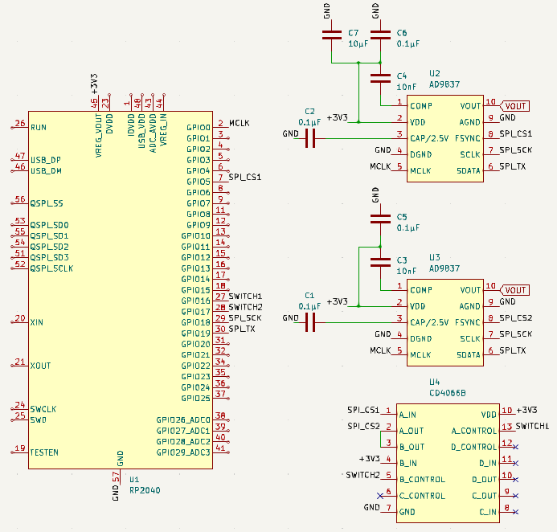

# AD9837 Synchronizer

This project demonstrates how to synchronize two AD9837 chips using a Raspberry
Pi Pico RP2040. I recently needed to generate sine and cosine waves for a
project and found the AD9837 wave generators to be an ideal choice. Although the
phase of the AD9837's output is adjustable, synchronizing two AD9837s is not a
built-in feature of this particular chip. In this context, synchronization means
having both chips produce a wave with the same frequency and phase upon startup.
I experimented with various methods, but most of them resulted in both AD9837s
generating waves with random phase shifts relative to each other. Using the
setup described below, it is possible to synchronize both AD9837s at startup and
subsequently adjust the phase of one of the AD9837s to produce a pair of
sinusoidal waves with a desired phase shift.

The synchronization process depends on shorting the chip select pins of both
AD9837s during the initialization process when setting the initial frequency and
phase values using SPI. After initialization, the CD4066B disconnects the short
between the chip select pins of both AD9837s and pulls the chip select pin of
the second AD9837 high, allowing the chip select of the first AD9837 to operate
independently. Following this disconnection, any desired phase shift can be
assigned to the first AD9837, while the phase of the second AD9837 remains
constant.

## Requirements

- Raspberry Pi Pico RP2040
- 2x AD9837 Function Generator Chips
- CD4066B Quad Bilateral Switch
- 1 10μF Capacitor
- 4 0.1μF Capacitors
- 2 10nF Capacitors
- Breadboard and jumper wires

## Wiring Diagram



## Installation and Usage

1. Clone the repository:

```bash
git clone https://github.com/MarcEftimie/AD9837-synchronizer.git
```

2. Open the AD9837_sync.ino file in the Arduino IDE.

3. Upload the code to your Raspberry Pi Pico RP2040.

4. The first AD9837 chip should produce a sine wave and the second AD9837 chip
   should produce a cosine wave. You can adjust the phase difference between the
   waves by changing the PHASE_DIFF variable in the AD9837_sync.ino script.

## License

This project is released under the MIT License.

## Author

Created by Marc Eftimie.
